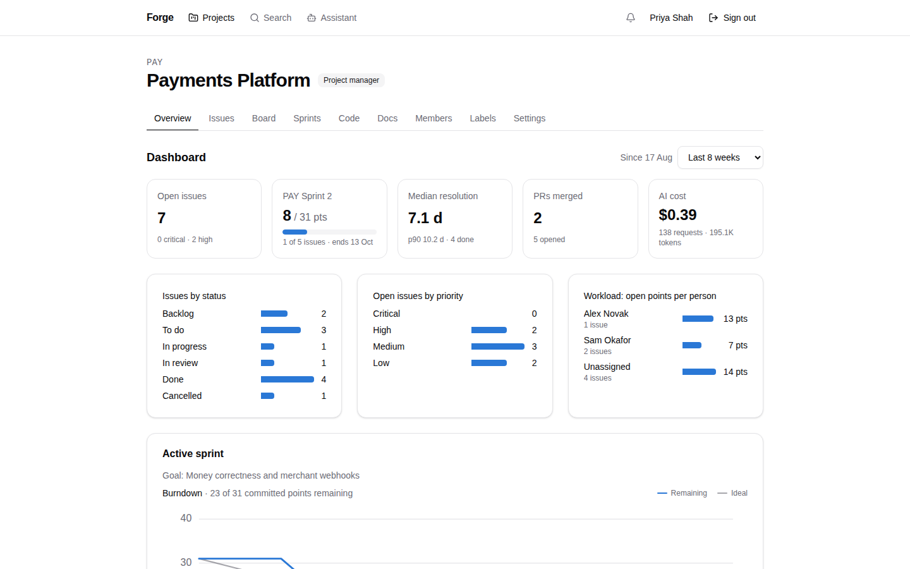
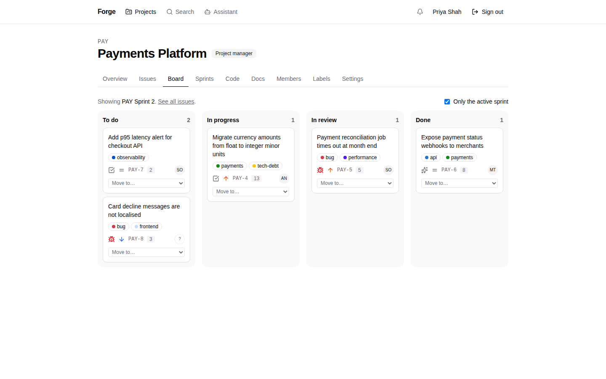
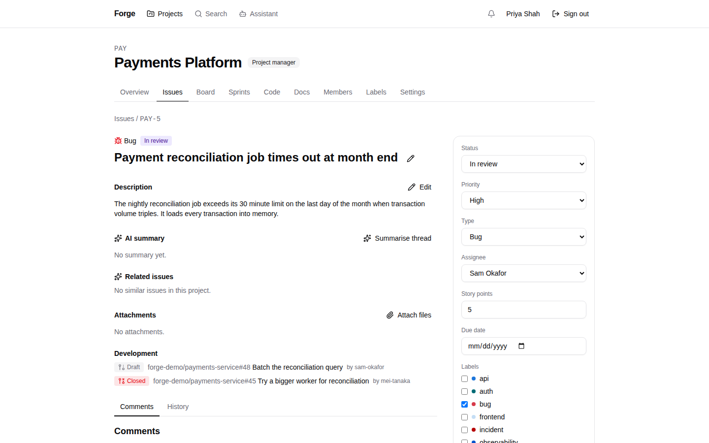
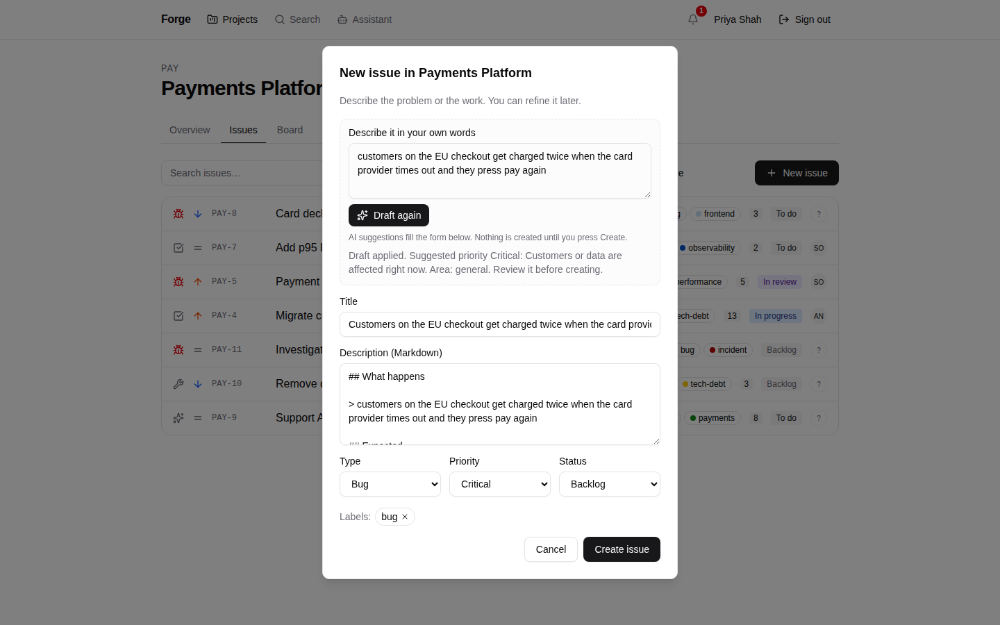
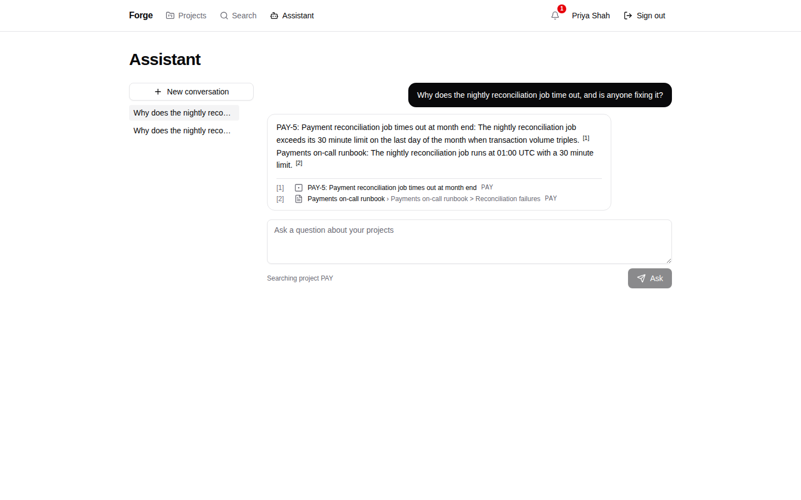
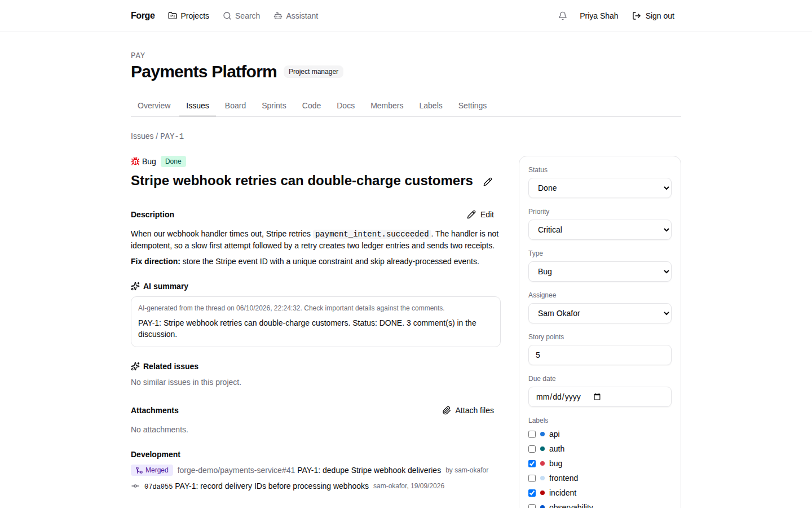
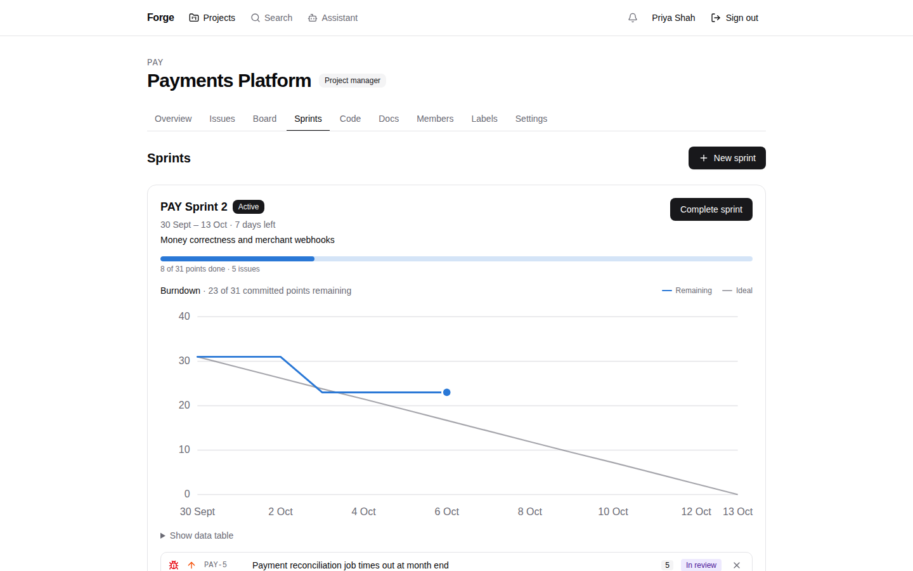
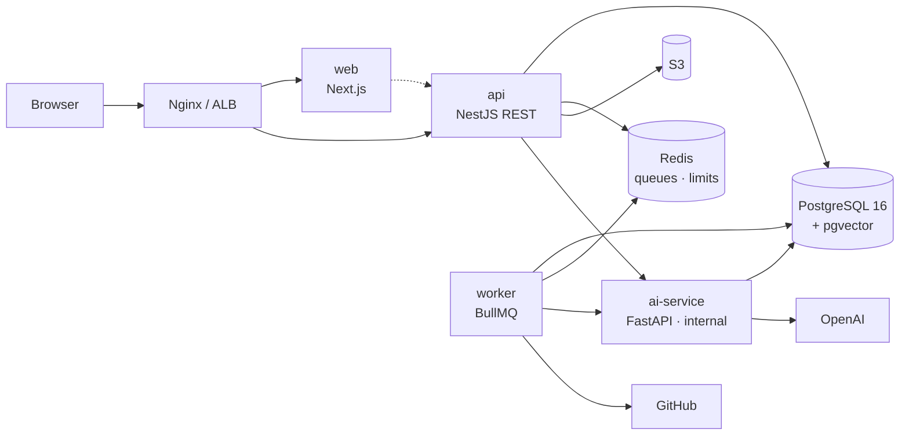
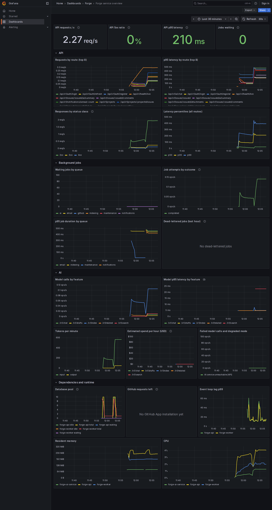

# Forge

**An engineering issue tracker with GitHub and AI built in.** Teams manage projects, issues
and sprints and connect their GitHub repositories. AI helps where it saves time: it drafts
well-formed issues, summarises long threads, finds duplicates, reviews pull requests and
answers questions about the project's history with cited sources.

AI is a feature of the product, not the product. Every core workflow keeps working when the
AI service is off.



Forge is a full-stack portfolio project, built in 20 reviewed phases from
[requirements](docs/requirements.md) to an AWS deployment written in Terraform. Every claim
below links to the code or the measurement behind it. [docs/cv.md](docs/cv.md) gives the
same story as a summary for a CV and an interview.

## What it does

| Feature                                                                                                                                                                                                                                                                                                                                                                                                                                 | Screenshot                                                                   |
| --------------------------------------------------------------------------------------------------------------------------------------------------------------------------------------------------------------------------------------------------------------------------------------------------------------------------------------------------------------------------------------------------------------------------------------- | ---------------------------------------------------------------------------- |
| **Projects, issues and sprints**<br/>Per-project roles (manager, developer, viewer). Issues have a status workflow, history, comments, labels, attachments and optimistic locking. The board supports drag and drop. Notifications are delivered through a transactional outbox.                                                                                                                                                        |                                    |
| **GitHub integration**<br/>A GitHub App syncs repositories, pull requests and commits through signed webhooks. An issue key such as `PAY-5` in a branch, commit or pull request links it to the issue ([setup](docs/github-app-setup.md), [ADR-0008](docs/adr/0008-github-app-integration.md)).                                                                                                                                         |              |
| **AI issue assistant**<br/>Describe a problem in your own words and a structured draft streams into the form, with a suggested type, priority and labels. Nothing is created until you press Create.                                                                                                                                                                                                                                    |           |
| **Cited answers over project history (RAG)**<br/>Issues, comments, documents and pull requests are indexed in pgvector. Hybrid retrieval (vector plus full text) answers questions, and every claim cites its source. A retrieval evaluation in CI fails if hit-rate@5 drops below 0.8 ([ADR-0007](docs/adr/0007-no-rag-framework-for-core-pipeline.md), [ADR-0014](docs/adr/0014-rag-indexing-ownership-and-chat-tool-round-trip.md)). |  |
| **AI summaries and code review**<br/>Thread summaries are made in the background, cached, and marked out of date when the thread changes. Pull request reviews are made per commit with severity-ranked findings, and they never write to GitHub ([ADR-0015](docs/adr/0015-ai-review-stays-read-only-on-github.md)). Per-user budgets cap the cost.                                                                                     |                     |
| **Sprints and the dashboard**<br/>Burndown from the issue history, velocity across completed sprints, open work by status, priority and assignee, pull request activity and AI usage.                                                                                                                                                                                                                                                   |        |

The screenshots come from the demo seed, with the AI service on its deterministic fake
provider ([ADR-0013](docs/adr/0013-ai-provider-fake-and-contract-files.md)). With an OpenAI key
the same screens show model output. `pnpm --filter @forge/e2e screenshots` retakes them from
a running stack.

## Architecture



The system is a modular NestJS monolith with a BullMQ worker, plus one Python service for
everything that talks to a model ([ADR-0001](docs/adr/0001-modular-monolith-plus-ai-service.md)).
Writes that must lead to side effects, such as notifications, indexing and emails, go through a
transactional outbox, so a crash cannot lose them
([ADR-0006](docs/adr/0006-transactional-outbox.md)). Shared Zod schemas in `packages/types`
are the contract between the web app and the API.
[Architecture](docs/architecture.md) covers the containers, the module boundaries, the threat
model, the RAG design and the AWS deployment.

| Layer          | Technology                                                                              |
| -------------- | --------------------------------------------------------------------------------------- |
| Frontend       | Next.js 16, TypeScript, Tailwind CSS, shadcn/ui, TanStack Query, React Hook Form, Zod   |
| Backend        | NestJS, PostgreSQL 16, Prisma 7, Redis, BullMQ                                          |
| AI service     | Python, FastAPI, OpenAI API, pgvector, hybrid retrieval                                 |
| Infrastructure | Docker Compose, Terraform, AWS (ECS Fargate, RDS, ElastiCache, S3, ALB), GitHub Actions |
| Observability  | Structured JSON logs with one request ID end to end, Prometheus, Grafana, Sentry        |
| Testing        | Jest, Supertest, Testcontainers, Pytest, Playwright, axe, k6, OWASP ZAP                 |

## Quality evidence

| What          | Result                                                                                                                                                                          | Evidence                                                |
| ------------- | ------------------------------------------------------------------------------------------------------------------------------------------------------------------------------- | ------------------------------------------------------- |
| Tests         | About 870 automated tests: 404 API (unit, HTTP, and integration against real Postgres and Redis), 165 shared-schema, 141 web component, 144 Python and 13 browser journeys      | [testing](docs/testing.md)                              |
| Coverage      | API domain services: lines 95.4 %, branches 78 %. CI fails below 90 % of lines overall or 80 % in any one service                                                               | [testing](docs/testing.md#coverage-nfr-10)              |
| Performance   | p95 of 14.5 ms for the CRUD mix at 50 req/s (target 250 ms) and 25 ms for the issue list over 100,000 issues (target 150 ms). The load tests found and fixed three slow queries | [performance](docs/performance.md)                      |
| Security      | OWASP ASVS Level 1: 68 requirements met, one gap (admin MFA). Nonce-based CSP, a least-privilege database login, gitleaks and a ZAP baseline on every pull request              | [ASVS](docs/asvs.md), [security](docs/security.md)      |
| Accessibility | axe WCAG 2.1 AA checks on the core pages in the browser tests                                                                                                                   | [testing](docs/testing.md#end-to-end-journeys-phase-13) |
| Supply chain  | Images scanned by Trivy (fixable High and Critical fail the build), signed, with an SBOM and provenance that deploys verify                                                     | [CI/CD](docs/cicd.md)                                   |
| Operations    | RED metrics per route, queue and LLM metrics, alert rules with their own tests, Grafana and CloudWatch dashboards                                                               | [observability](docs/observability.md)                  |



**What is not done.** The AWS stack is written, tested with `terraform test` against mocked
providers, and scanned, but it has not been applied to a live AWS account, so there is no
public demo. Administrators have no second factor yet (ASVS 4.3.1). Both are recorded where
they matter: [deployment](docs/deployment.md) and [ASVS gaps](docs/asvs.md#gaps).

## Run it

**Prerequisites:** Docker, Node.js 22 (`.nvmrc`) and pnpm 10 (`corepack enable`).

```bash
pnpm install
pnpm stack:up      # production images behind Nginx on http://localhost:8080
pnpm stack:seed    # demo users, projects, sprints, issues and pull requests
```

Sign in at http://localhost:8080 as `priya@forge.local` (project manager), `sam@forge.local`
(developer), `jordan@forge.local` (viewer on PAY) or `admin@forge.local`. All use the password
`forge-demo-password`. Without `OPENAI_API_KEY` the AI features run on the fake provider.
`pnpm stack:down` stops everything.

### Developing

```bash
cp .env.example .env
pnpm install && (cd apps/ai-service && uv sync)     # uv: https://docs.astral.sh/uv/
pnpm infra:up                                       # Postgres, Redis, Mailpit, SeaweedFS
pnpm --filter @forge/api db:deploy && pnpm --filter @forge/api db:seed
pnpm dev                                            # web :3000, api :4000, ai-service :8000
```

| URL                            | What                                                  |
| ------------------------------ | ----------------------------------------------------- |
| http://localhost:3000          | Web app with hot reload                               |
| http://localhost:4000/api/docs | Swagger UI (OpenAPI JSON at `/api/docs/openapi.json`) |
| http://localhost:8025          | Mailpit, which catches all outgoing email             |

| Command                                     | Does                                                                        |
| ------------------------------------------- | --------------------------------------------------------------------------- |
| `pnpm check`                                | Lint, typecheck and test every package, Python included (what CI runs)      |
| `pnpm --filter @forge/api test:integration` | Database tests against a throwaway Postgres (needs Docker)                  |
| `pnpm e2e`                                  | Browser journeys and accessibility checks                                   |
| `pnpm stack:perf-seed`                      | Load the 100,000-issue dataset for the [k6 load tests](docs/performance.md) |
| `pnpm docs:check`                           | Check every relative link and image in the Markdown docs                    |

## Repository layout

```
apps/
  web/          Next.js app (App Router)
  api/          NestJS REST API and BullMQ worker; Prisma schema, migrations and seeds
  ai-service/   FastAPI: drafts, summaries, RAG and code review (Python, uv)
packages/
  types/        Zod schemas and TypeScript types shared by web and api
  ui/           shadcn/ui components and design tokens
  config/       Shared TypeScript, ESLint and Prettier presets
infrastructure/
  docker/       Nginx, Postgres init, SeaweedFS and the stack's secrets generator
  terraform/    AWS: bootstrap, modules and environments
e2e/            Playwright journeys, axe checks and the screenshot script
perf/           k6 load tests
observability/  Prometheus, alert rules and their tests, the Grafana dashboard
scripts/        Repository checks (Markdown links)
docs/           Requirements, architecture, ADRs and the documents below
```

## Documentation

- [Requirements](docs/requirements.md): the problem, roles and permission matrix,
  functional and non-functional requirements, and the delivery plan
- [Architecture](docs/architecture.md): containers, modules, the outbox, the threat model,
  AI and RAG design, AWS, and API conventions
- [Database design](docs/database.md): ER diagrams, integrity rules, indexes and search
- [API reference](docs/api.md): conventions, errors and endpoints
- [Security](docs/security.md) and [ASVS](docs/asvs.md): controls, how each is tested,
  and the Level 1 checklist
- [Performance](docs/performance.md): the load tests, the results and the query plans
- [Testing](docs/testing.md): the test layers, the coverage gate and the browser journeys
- [Running in containers](docs/docker.md), [CI/CD](docs/cicd.md) and
  [deploying to AWS](docs/deployment.md)
- [Observability](docs/observability.md): request IDs, metrics, dashboards, alerts and errors
- [GitHub App setup](docs/github-app-setup.md)
- [Architecture decision records](docs/adr): the significant choices and the alternatives
  rejected
- [CV notes](docs/cv.md): the project summary, CV bullets and talking points

## Licence

[MIT](LICENSE)
