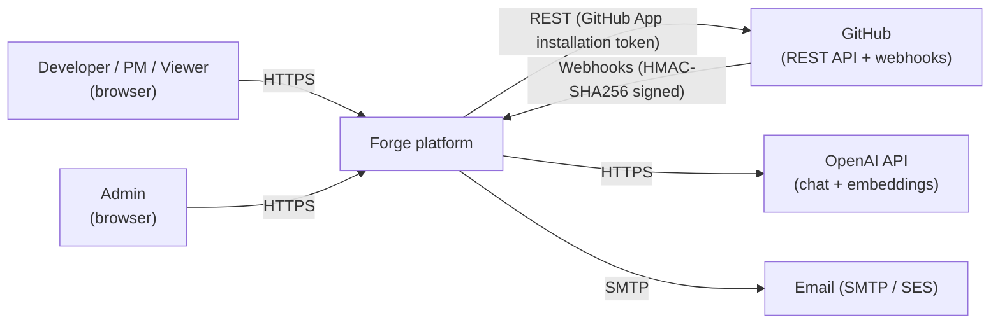
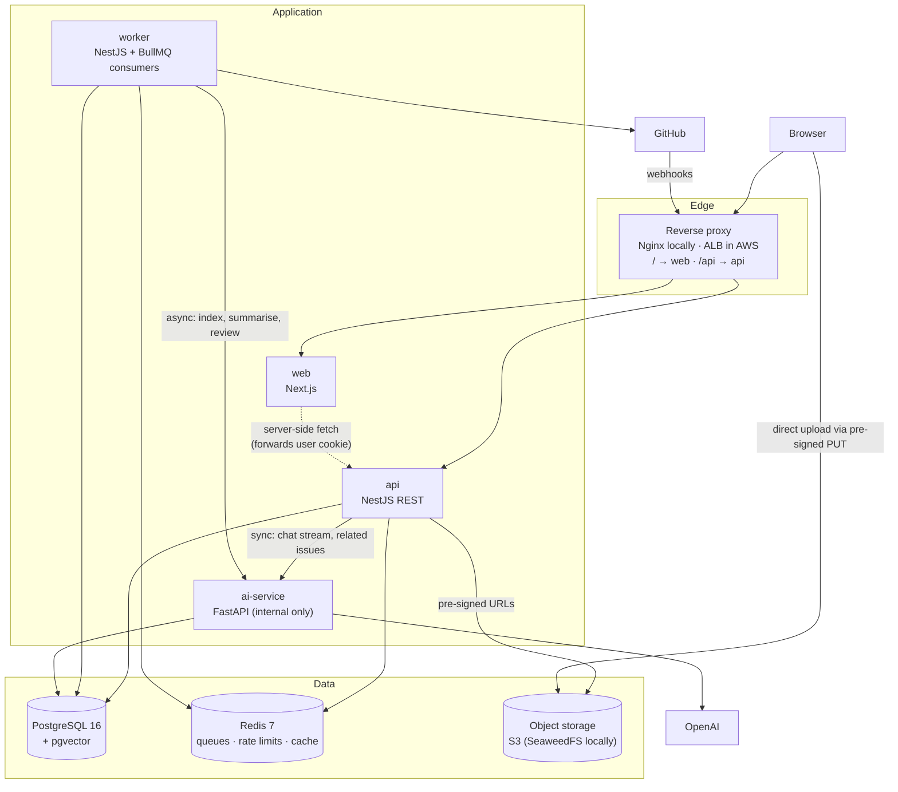
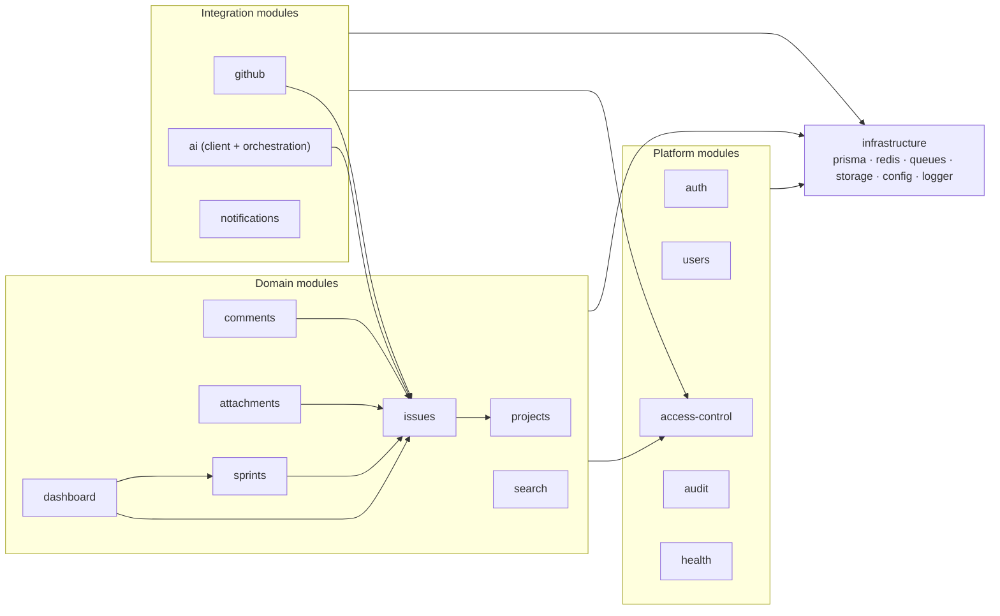
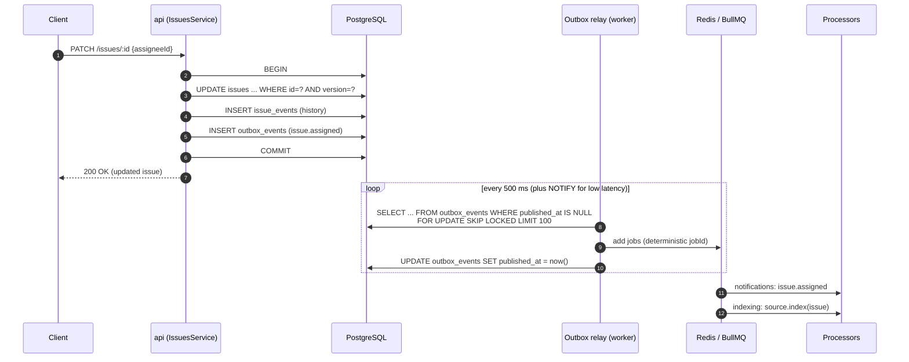
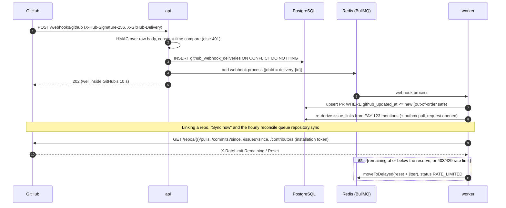
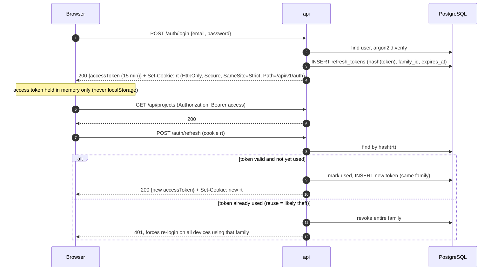
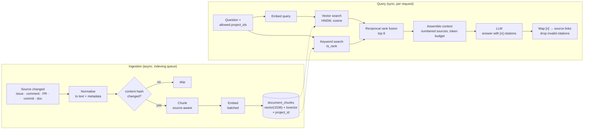
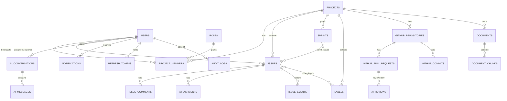
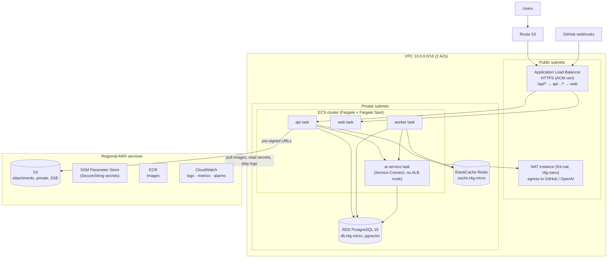

# Architecture

> **Phase 1 deliverable.** This describes the target design. Each later phase updates the
> section it touches, and any deviation is recorded as an ADR in [`adr/`](adr).
> Requirements referenced as `FR-x` / `NFR-x` are in [`requirements.md`](requirements.md).

## 1. Architectural style

Forge is a **modular monolith plus one AI service**, running as four deployable processes that
share one PostgreSQL database and one Redis instance.

| Process      | Tech                                                | Responsibility                                                               |
| ------------ | --------------------------------------------------- | ---------------------------------------------------------------------------- |
| `web`        | Next.js (App Router), TypeScript                    | UI. Server components for first paint, TanStack Query for client state       |
| `api`        | NestJS, Prisma                                      | REST API, auth, RBAC, all core domain logic, webhook intake, enqueueing jobs |
| `worker`     | NestJS (same codebase, separate entrypoint), BullMQ | Background jobs: notifications, GitHub sync, indexing, AI jobs               |
| `ai-service` | Python, FastAPI                                     | Chunking, embeddings, retrieval, LLM calls, prompt management, AI evaluation |

Why this shape (full reasoning in [ADR-0001](adr/0001-modular-monolith-plus-ai-service.md)):

- **A monolith for the core domain.** Issues, sprints, projects and permissions are tightly
  coupled and change together. Splitting them into microservices would add distributed
  transactions and network hops without adding capability. NestJS modules with enforced
  boundaries give the same separation inside one process.
- **A separate AI service,** because the Python AI ecosystem (tokenisers, OpenAI SDK, eval
  tooling) is where the useful libraries are. AI calls also have very different latency, cost and
  scaling profiles from CRUD. Isolating them means an AI outage or slowdown can't take down
  issue tracking (NFR-4).
- **A separate `worker` process from the same codebase,** so slow jobs never share an event
  loop with HTTP requests, and each can scale on its own signal (queue depth versus request rate).

## 2. System context



## 3. Containers



Key points:

- **One origin.** The browser only talks to the proxy, so `web` and `api` share an origin.
  During development (apps running on the host with hot reload), a Next.js rewrite of
  `/api/*` plays the proxy's role; Nginx takes over in the fully containerised stack (Phase 14). The
  refresh cookie can be `SameSite=Strict` and CORS is only needed for local tooling.
- **`ai-service` is never exposed publicly.** It accepts calls from `api` and `worker` only,
  authenticated with a shared service token (an internal network plus a bearer secret, as
  defence in depth). It never sees end-user JWTs, and it trusts the `project_ids` the API sends
  because the API has already done authorisation (§7.4).
- **Database ownership.** Prisma in `api` owns the **entire schema and all migrations**,
  including the pgvector tables (through raw SQL inside Prisma migrations). `ai-service`
  connects with a separate Postgres role that can only read and write `documents`,
  `document_chunks` and `ai_*` tables and cannot touch core tables. See
  [ADR-0004](adr/0004-single-migration-owner.md).

## 4. Backend module structure (`apps/api`)



Every module has the same internal layout:

```
issues/
├── issues.module.ts
├── issues.controller.ts         # HTTP only: parse, validate (Zod), call service, map to DTO
├── issues.service.ts            # use cases, transactions, authorisation checks
├── issues.repository.ts         # the only file that touches Prisma for this aggregate
├── issue-status.machine.ts      # pure domain logic (unit-tested without a DB)
├── dto/                         # Zod schemas shared via packages/types
├── events/                      # domain events emitted after commit
└── __tests__/
```

**Rules** (enforced with `eslint-plugin-boundaries` from Phase 4, when the first domain modules exist):

1. Controllers never import repositories.
2. A module talks to another module only through its exported service, never through its repository.
3. Side effects (notifications, indexing, audit) are triggered by **domain events published
   after the transaction commits** (transactional outbox, §5.2). Services do not call the
   notification module directly.

## 5. Asynchronous architecture

### 5.1 Queues

| Queue           | Producer                             | Job examples                                                                    | Concurrency | Retry                                                                                   |
| --------------- | ------------------------------------ | ------------------------------------------------------------------------------- | ----------- | --------------------------------------------------------------------------------------- |
| `notifications` | outbox relay                         | `issue.assigned`, `comment.added`, `sprint.started`, `pull_request.opened`      | 10          | 5 × exp. backoff                                                                        |
| `github`        | api (link, sync, webhook), scheduler | `installation.sync`, `repository.sync`, `webhook.process`, `reconcile` (hourly) | 4           | 5 × exp.; rate limits re-delay to the reset without using a retry; 403/404 fail at once |
| `indexing`      | outbox relay                         | `source.index`, `source.delete`                                                 | 4           | 5 × exp.                                                                                |
| `ai`            | api                                  | `issue.summarise`, `pr.review`                                                  | 2           | 3 × exp.                                                                                |
| `email`         | notifications processor              | `send`                                                                          | 5           | 5 × exp.                                                                                |
| `maintenance`   | job schedulers (worker)              | `attachments.cleanup` (hourly), `outbox.prune` (daily)                          | 1           | none (next run retries)                                                                 |

- Failed jobs go to a per-queue **dead-letter** state, kept for 7 days and shown on an admin page.
- **Idempotency:** every job ID is deterministic (for example `index:issue:{id}:{contentHash}`),
  so duplicate enqueues collapse, and processors upsert rather than insert.
- **Scheduling:** BullMQ repeatable jobs handle GitHub reconciliation (hourly) and cleanup of
  expired tokens (daily).

### 5.2 Transactional outbox

Writing an issue and enqueueing a job to Redis are two separate systems, and there is no
distributed transaction across them. To avoid "saved but never notified" or "notified but
rolled back":



This gives at-least-once delivery, and deterministic job IDs make that safe to repeat. See
[ADR-0006](adr/0006-transactional-outbox.md).

### 5.3 GitHub sync (Phase 8)



Handlers use only the payload, so webhooks spend no rate limit. Only repositories linked to a
project are synced. The first sync is full (bounded by `GITHUB_SYNC_MAX_PAGES`), and later ones
fetch changes since the previous run, with a five-minute overlap.

**As built (Phase 6b, extended in 7).** Issue, comment and sprint services call
`writeOutbox(tx, …)` inside their transaction (`issue.assigned`, `comment.added`,
`sprint.started`, `sprint.completed`). An `AFTER INSERT … FOR EACH STATEMENT` trigger issues `pg_notify('outbox_events')`,
which Postgres delivers only on commit; the relay (`OutboxRelay`, worker) LISTENs on a dedicated
connection and falls back to a 500 ms poll if that connection drops. Each batch is claimed with
`FOR UPDATE SKIP LOCKED`, added to BullMQ with job ID `outbox-{id}`, and marked published in the
same transaction, so a Redis failure leaves the rows pending. The notifications processor
reloads current state (skipping events that no longer apply, such as a reassigned issue) and
inserts with a per-recipient `dedupe_key`, so a redelivered event creates nothing new. Tests
prove three relays draining 250 rows concurrently never publish one twice, and that removing
the row lock or the dedupe key breaks them.

### 5.3 What is synchronous and what is not

| Operation                     | Mode                           | Why                                                                                                                                        |
| ----------------------------- | ------------------------------ | ------------------------------------------------------------------------------------------------------------------------------------------ |
| Issue CRUD, search, dashboard | Sync                           | Pure DB work, fast                                                                                                                         |
| AI issue draft (FR-7.1)       | Sync, **streamed** (SSE)       | The user is waiting at a form. One small LLM call streamed from the first token feels immediate, and Node streams it with non-blocking I/O |
| Related issues (FR-7.3)       | Sync                           | One embedding plus one indexed vector query, under 300 ms                                                                                  |
| Assistant chat (FR-7.4)       | Sync, **streamed** (SSE)       | Interactive, the same reasoning as drafting                                                                                                |
| Summarise thread (FR-7.2)     | **Async** job → `202` + job ID | Long threads mean long prompts. The result is cached and a notification is sent when ready                                                 |
| PR code review (FR-9)         | **Async** job                  | Multi-file, multiple LLM calls, can take tens of seconds                                                                                   |
| Indexing / embeddings (FR-8)  | **Async**                      | Triggered by writes and never visible to the user as latency                                                                               |
| GitHub sync (FR-6)            | **Async**                      | Paginated external API with rate limits                                                                                                    |

The brief says "do not make expensive AI operations block normal API requests". Streaming
endpoints hold a connection open but do not block the event loop or any other request.
Anything that is expensive and has **no user waiting on it** goes to a queue. Async jobs are
exposed consistently:

```
POST /issues/:id/ai/summaries       → 202 { jobId, statusUrl: "/ai/jobs/:jobId" }
GET  /ai/jobs/:jobId                → { status: queued|running|completed|failed, result?, error? }
```

The UI polls `statusUrl` with TanStack Query, or receives a notification via SSE.

## 6. Security architecture

### 6.1 Authentication flow



Decisions ([ADR-0003](adr/0003-auth-tokens.md), [ADR-0010](adr/0010-es256-access-tokens-and-revocation.md)): argon2id password hashing; access JWT signed
with an asymmetric key pair (ES256) so the key can be rotated through `kid`; refresh tokens are
opaque random 256-bit values stored **hashed** (SHA-256); CSRF risk on the refresh endpoint is
mitigated by `SameSite=Strict`, the narrow cookie `Path` and an `Origin` header check.

### 6.2 Authorisation

- A global `JwtAuthGuard` means every route is authenticated unless it is marked `@Public()`.
- `@RequireProjectPermission('issue:update')` is resolved by a `ProjectAccessGuard`. The guard
  loads the caller's membership for the project that owns the resource (issue → project, sprint
  → project), caches it in Redis for 60 s, and returns **404** when the caller is not a member.
- Permissions are mapped to roles in code (`access-control/permissions.ts`), not in the DB. They
  are version-controlled, unit-tested against the permission matrix in requirements §2, and
  cannot be changed at runtime by a compromised admin account.
- Ownership rules (such as "Developer may edit **own** comment") are checked in the service,
  because only the service has loaded the resource.

### 6.3 Threat model: OWASP Top 10 (2021) mapping

| Risk                          | Control in Forge                                                                                                                                                                    |
| ----------------------------- | ----------------------------------------------------------------------------------------------------------------------------------------------------------------------------------- |
| A01 Broken access control     | Global auth guard; project guard on every project-scoped route; 404 on non-membership; IDOR tests for every resource type in the Supertest suite                                    |
| A02 Cryptographic failures    | TLS at the ALB; argon2id; hashed refresh and reset tokens; RDS/S3 encryption at rest; no secrets in the repo (gitleaks)                                                             |
| A03 Injection                 | Prisma parameterised queries; `$queryRaw` only with tagged templates (lint rule bans `$queryRawUnsafe`); Zod validation on every input; Markdown sanitised with DOMPurify on render |
| A04 Insecure design           | This threat model; rate limits; state machines for status and sprint transitions                                                                                                    |
| A05 Security misconfiguration | Helmet (strict CSP, HSTS, `X-Content-Type-Options`, `frame-ancestors 'none'`); explicit CORS allow-list; production error responses without stack traces                            |
| A06 Vulnerable components     | Dependabot; `pnpm audit` / `pip-audit`; Trivy image scan in CI                                                                                                                      |
| A07 Auth failures             | Refresh rotation with reuse detection; login throttling; breached-password check; generic login errors                                                                              |
| A08 Integrity failures        | GitHub webhook HMAC verified with a constant-time compare on the raw body; pinned action SHAs in CI; signed image digests deployed                                                  |
| A09 Logging failures          | Audit log (FR-13); structured logs with request ID; secrets and tokens redacted by a logger serializer                                                                              |
| A10 SSRF                      | Only fixed outbound hosts (GitHub API, OpenAI). No user-supplied URLs are fetched server-side. Attachments go browser → S3 directly                                                 |

### 6.4 LLM-specific risks (OWASP LLM Top 10)

| Risk                                                             | Control                                                                                                                                                                                                                                |
| ---------------------------------------------------------------- | -------------------------------------------------------------------------------------------------------------------------------------------------------------------------------------------------------------------------------------- |
| Prompt injection (direct and indirect via indexed issues or PRs) | Retrieved content is wrapped in delimited `<context>` blocks and labelled as untrusted data. The model has **no write tools**: its only tool is read-only structured queries. Output is only ever shown to the user and never executed |
| Sensitive information disclosure                                 | Permission-aware retrieval (§7.4); per-project filtering is enforced in SQL, not by the prompt                                                                                                                                         |
| Insecure output handling                                         | LLM output is rendered as sanitised Markdown; structured outputs are validated against a JSON schema before use                                                                                                                        |
| Excessive agency                                                 | AI drafts are suggestions the user must confirm; PR comments are only posted on an explicit click                                                                                                                                      |
| Unbounded consumption / cost                                     | Per-user rate limit and daily token budget; max input tokens per request; diff size cap for reviews                                                                                                                                    |

### 6.5 Rate limiting

Redis-backed sliding-window limits (`@nestjs/throttler` with Redis storage):

| Scope                                        | Limit                                        |
| -------------------------------------------- | -------------------------------------------- |
| `POST /auth/login`, `/auth/password-reset/*` | 5 / min per IP and per email                 |
| Authenticated API (default)                  | 300 / min per user                           |
| AI endpoints                                 | 20 / min per user, plus a daily token budget |
| Webhook intake                               | 100 / s globally (GitHub retries on failure) |

## 7. AI and RAG architecture

### 7.1 AI service internals (`apps/ai-service`)

```
app/
├── api/            # FastAPI routers: /v1/drafts, /v1/summaries, /v1/related, /v1/chat, /v1/index, /v1/reviews
├── core/           # config (pydantic-settings), logging, auth dependency, errors
├── llm/            # provider interface, OpenAI implementation, fake provider for tests, token counting and cost
├── prompts/        # versioned prompt templates (Jinja2), each with a version ID stored with its outputs
├── rag/
│   ├── chunking.py     # source-aware chunkers
│   ├── embedder.py     # batched embeddings with retry
│   ├── store.py        # pgvector reads and writes (psycopg 3, SQL only, no ORM)
│   ├── retriever.py    # hybrid retrieval + reciprocal rank fusion
│   └── answer.py       # context assembly, citation mapping
├── review/         # diff parsing, per-file review, aggregation
└── evals/          # retrieval hit-rate and answer-faithfulness evaluation sets
```

**LangChain/LlamaIndex: deliberately not used for the core pipeline** ([ADR-0007](adr/0007-no-rag-framework-for-core-pipeline.md)).
The pipeline is roughly 400 lines of straightforward code: chunk, embed, one SQL query, one
prompt. Writing it directly keeps every step visible, testable and debuggable, which is what an
interviewer will ask about. A framework would be added only where it removes real work, for
example a well-tested Markdown splitter.

The provider sits behind an interface (`LLMProvider`, `EmbeddingProvider`), so tests use a
deterministic fake and no test ever calls OpenAI. Model names are configuration
(`OPENAI_CHAT_MODEL`, `OPENAI_EMBEDDING_MODEL`), not code.

**As built (Phase 9).** Drafts and summaries are live. `llm/` has the provider interface, the
OpenAI implementation (strict structured outputs, streamed, usage included) and the deterministic
fake ([ADR-0013](adr/0013-ai-provider-fake-and-contract-files.md)). Prompts are Jinja2 templates
with a version ID stored alongside every output. Structured output is validated with Pydantic and
repaired at most once. The API relays the draft stream to the browser with `fetch` (EventSource
cannot POST), and it records every call in `ai_usage`. Summaries are worker jobs cached by a
content hash of the thread. When the AI service is down, the API answers 503 before queueing
anything, and the web app hides the AI actions. Related issues and chat arrive with the RAG
pipeline in Phase 10.

### 7.2 RAG pipeline



**Chunking strategy** (source-aware, not a fixed-size split everywhere):

| Source   | Unit    | Strategy                                                                                                        |
| -------- | ------- | --------------------------------------------------------------------------------------------------------------- |
| Issue    | issue   | Title + metadata header + description. Split on Markdown headings only if > 800 tokens                          |
| Comment  | comment | One chunk per comment, prefixed with "Comment on PAY-123 by X:" for context                                     |
| PR       | PR      | Title + body + list of changed files                                                                            |
| Commit   | commit  | Message + list of files (diffs are not embedded because they are noisy and expensive)                           |
| Document | section | Split by Markdown heading hierarchy, target 500 tokens with 50 tokens of overlap, heading path kept as metadata |

Each chunk stores `source_type`, `source_id`, `project_id`, a `url` for citation, `content_hash`,
`embedding_model` (so a model change can trigger a re-embed) and the chunk text.

**Why hybrid retrieval:** pure vector search misses exact tokens that engineers type (`PAY-123`,
`NullPointerException`, `stripe_webhook`). Keyword search catches those, and vector search
catches paraphrases ("can't log in" ≈ "authentication failure"). Reciprocal rank fusion
combines both without having to tune score scales.

**Structured questions:** "What bugs were fixed in the last sprint?" is a database query, not a
similarity search. The chat endpoint gives the model **one read-only tool**,
`query_issues(project_id, filters)`, which calls back into the API's search endpoint with the
user's permissions. Retrieval covers "why" and "what caused" questions; the tool covers "which"
and "how many" questions. The answer cites both kinds of source.

### 7.3 Feature flows

| Feature        | Flow                                                                                                                                                                                          |
| -------------- | --------------------------------------------------------------------------------------------------------------------------------------------------------------------------------------------- |
| Issue draft    | api → ai `/v1/drafts` with text and the project's label list → structured output (JSON schema) → validated → streamed to the form                                                             |
| Related issues | api → ai `/v1/related` with issue ID → reuse the stored issue embedding → kNN in the same project, excluding itself → threshold 0.78                                                          |
| Summary        | worker → ai `/v1/summaries` → stored in `ai_summaries` keyed by thread hash → notification                                                                                                    |
| Chat           | api → ai `/v1/chat` (SSE) with message history, `allowed_project_ids` and a tool callback URL → stream tokens + final `sources[]`                                                             |
| PR review      | worker fetches the PR and files from GitHub → filters (skip lock, generated, binary; cap 60k tokens) → ai `/v1/reviews` → per-file findings + summary + missing tests → stored → notification |

### 7.4 Permission-aware retrieval

The biggest real risk in a RAG system inside a multi-project tool is that it **leaks data across
projects**. For example, a Viewer on project A asks a question and the answer quotes a comment
from private project B. Prompting cannot prevent this; it has to be prevented in the query:

1. The API resolves the caller's accessible `project_ids` from memberships (it already has
   them cached for RBAC).
2. It passes them to ai-service, which **requires** the field. An empty list returns nothing.
3. Every retrieval SQL statement includes `WHERE project_id = ANY($1)`. The combined index and
   partial HNSW strategy for this is designed in Phase 3.
4. An integration test creates two projects and asserts that a user in one never receives chunks
   from the other, through both chat and semantic search.

### 7.5 Evaluation and cost tracking

- `evals/retrieval.jsonl`: about 40 hand-written question → expected-source pairs over the seed
  data. CI computes hit-rate@5 and MRR and fails if hit-rate@5 < 0.8. Because the eval runs on
  the fake embedder for determinism, the CI gate checks the pipeline wiring; a manual run with
  real embeddings measures quality.
- Every LLM call writes a row to `ai_usage` (feature, model, prompt version, input and output
  tokens, latency, estimated cost, user, project). This row feeds the dashboard (FR-10) and the
  daily budget (NFR-12).

**As built (Phase 10).** The pipeline above is live, with these decisions recorded in
[ADR-0014](adr/0014-rag-indexing-ownership-and-chat-tool-round-trip.md):

- The API normalises each source (a header line such as `Issue PAY-12: …` with its facts, then
  the body) and writes `documents`; the AI service chunks, embeds and writes `document_chunks`.
  Issue, comment and document writes add a `search.index` event to the outbox; GitHub syncs and
  webhooks queue a per-repository job; a backfill job at worker start and every six hours repairs
  anything that failed. Jobs for the same source collapse (BullMQ deduplication).
- A pull request or commit in a repository linked to several projects has one document per
  project. Identical text reuses stored vectors, so the copies cost nothing to embed.
- The `query_issues` tool is executed by the API, not by a callback from the AI service: the chat
  stream ends with a `tool_call` event, and the API sends the results in a second request.
- Keyword retrieval matches any query term (an OR over `plainto_tsquery` lexemes) and ranks with
  `ts_rank_cd`; an AND would make natural-language questions match nothing. Vector search uses
  HNSW with `hnsw.iterative_scan = relaxed_order`, so a selective project filter still returns
  enough rows.
- Related issues reuse the issue's stored vector. The threshold belongs to the embedding model
  (0.55 for `text-embedding-3-small`, whose similarities run lower than the 0.78 sketched in §7.3;
  `RELATED_MIN_SCORE` overrides it). It is a starting point, to be tuned on real data.
- The eval (`apps/ai-service/evals/`, 42 questions over a corpus that mirrors the demo seed)
  runs in CI against real pgvector. With the fake embedder, hybrid retrieval scores hit-rate@5
  1.00 and MRR 0.935; vector-only and keyword-only also reach 1.00 (MRR 0.945 and 0.897),
  because the fake embedder measures word overlap too. So the gate catches broken wiring
  (chunking, storage, the project filter, fusion), not ranking quality. What keyword search adds
  over vectors, exact identifiers such as `PAY-1` and `payment_intent.succeeded`, is tested
  directly in `test_rag_db.py`. `EVAL_EMBEDDER=openai` runs the same eval with real embeddings.

## 8. Data architecture (overview)

The detailed schema, indexes and constraints are documented in [`database.md`](database.md).
The high-level entity model:



Tables beyond the brief's list, and why:

| Table                                               | Reason                                                                                                                                                               |
| --------------------------------------------------- | -------------------------------------------------------------------------------------------------------------------------------------------------------------------- |
| `issue_events`                                      | Field-level issue history (FR-4.7), which is also the input for burndown (FR-5.5). `audit_logs` covers security events, a different concern with different retention |
| `refresh_tokens`, `password_reset_tokens`           | Hashed, revocable token storage (FR-1)                                                                                                                               |
| `outbox_events`                                     | Transactional outbox (§5.2)                                                                                                                                          |
| `github_installations`                              | GitHub App installation per account or organisation (FR-6.1)                                                                                                         |
| `issue_links`                                       | Issue ↔ PR/commit links detected from `PAY-123` mentions (FR-6.4)                                                                                                    |
| `ai_jobs`, `ai_summaries`, `ai_reviews`, `ai_usage` | Async job status, cached results and cost tracking                                                                                                                   |
| `teams`, `team_members`                             | FR-2.3                                                                                                                                                               |

`documents` is generalised: it represents **every** indexable source (`source_type` +
`source_id`) as well as uploaded engineering documents. `document_chunks` therefore has a
single retrieval path for all sources.

## 9. Frontend architecture (`apps/web`)

- **App Router** with route groups: `(auth)` for login and register, and `(app)` for the
  authenticated shell. Server components fetch the first render, and TanStack Query takes over
  on the client (hydrated through `HydrationBoundary`).
- **API client** generated from the API's OpenAPI spec (`openapi-typescript`), plus Zod schemas
  shared from `packages/types`, so a forms schema and the API validation schema are the same
  object.
- **Forms:** React Hook Form with `zodResolver`.
- **UI:** shadcn/ui components in `packages/ui`, Tailwind, a dark/light theme, and Recharts for
  dashboards.
- **Auth:** the access token lives in memory. A single-flight refresh on 401 retries the
  original request once. Middleware redirects unauthenticated users on the server using
  the presence of the refresh cookie.

## 10. Deployment architecture (AWS)



Cost-aware choices ([ADR-0005](adr/0005-aws-ecs-fargate-cost-aware.md)):

| Choice                             | Instead of            | Saving / reason                                              |
| ---------------------------------- | --------------------- | ------------------------------------------------------------ |
| ECS Fargate (+ Spot for worker/ai) | EKS                   | No ~$73/month control-plane fee; far less to operate         |
| fck-nat on t4g.nano                | Managed NAT Gateway   | ~$3/month vs ~$32/month + data processing                    |
| SSM Parameter Store                | Secrets Manager       | Free for standard parameters                                 |
| RDS db.t4g.micro single-AZ (dev)   | Aurora / Multi-AZ     | Multi-AZ is a one-variable switch for prod                   |
| pgvector in RDS                    | OpenSearch / Pinecone | No extra service; one backup; transactional with source data |
| `desired_count = 0` switch         | Always on             | Scale to zero between demos (RDS stopped too)                |

Estimated dev cost when running is ~$60–75/month, and about $5/month when stopped (storage,
Route 53, ECR). The itemised table is in `docs/deployment.md` (Phase 16).

Environments: `dev` (built by Phase 16) and `prod` (the same Terraform modules with different
`tfvars`: Multi-AZ RDS, 2 tasks per service, no Spot for api/web). Terraform state is kept in
S3 with native lockfile locking. CI deploys through GitHub OIDC, so there are no long-lived AWS
keys.

## 11. Observability

| Signal  | Local                                                                                                                                                           | AWS                                                                 |
| ------- | --------------------------------------------------------------------------------------------------------------------------------------------------------------- | ------------------------------------------------------------------- |
| Logs    | pino (api/worker) and structlog (ai) as JSON to stdout; `docker compose logs`                                                                                   | CloudWatch Logs, 14-day retention                                   |
| Metrics | `/metrics` (prom-client, prometheus-fastapi-instrumentator) → Prometheus → Grafana                                                                              | CloudWatch Container Insights + alarms; Prometheus/Grafana optional |
| Traces  | OpenTelemetry → Jaeger (Could)                                                                                                                                  | X-Ray via ADOT sidecar (Could)                                      |
| Errors  | Sentry (all three apps; free tier)                                                                                                                              | Same                                                                |
| Health  | `/health/live` (process up), `/health/ready` (DB, Redis and, for api, _not_ ai-service, because the AI service being down is a degraded state, not "not ready") | ALB target group health checks                                      |

**Correlation:** the proxy or ALB assigns `X-Request-ID`. The API logs it and puts it in job data
and in calls to ai-service, and every log line in every service carries it. One ID follows a
request from click → API → queue → worker → AI → OpenAI.

**Key metrics and alerts:** HTTP p95 latency and 5xx rate per route; queue depth and
dead-letter count per queue; job duration; LLM latency, tokens, cost and error rate by
feature; GitHub rate-limit remaining; DB pool saturation.

## 12. Repository structure (target)

```
forge-engineering-platform/
├── apps/
│   ├── web/                 # Next.js
│   ├── api/                 # NestJS (api + worker entrypoints), Prisma schema and migrations
│   └── ai-service/          # FastAPI (uv-managed Python project)
├── packages/
│   ├── types/               # Zod schemas + inferred TS types shared by web and api
│   ├── ui/                  # shadcn/ui components
│   ├── config/              # shared eslint, tsconfig, prettier presets
│   └── api-client/          # generated OpenAPI client (Phase 5+)
├── infrastructure/
│   ├── docker/              # nginx.conf, postgres init (roles, extensions)
│   └── terraform/           # modules/ + environments/{dev,prod}/
├── observability/           # prometheus.yml, alert rules, grafana dashboards
├── e2e/                     # Playwright
├── docs/                    # this folder
├── .github/workflows/       # pr.yml, main.yml, security.yml
├── docker-compose.yml
├── pnpm-workspace.yaml
└── turbo.json
```

Tooling: **pnpm workspaces + Turborepo** for the TypeScript side (cached, dependency-aware
`lint`/`test`/`build`), **uv** for Python. The AI service is a workspace member only as far as
Turborepo tasks go (`turbo run test` shells out to `uv run pytest`), so one command runs every
check.

## 13. Architecture decision records

| ADR                                                    | Decision                                                                          |
| ------------------------------------------------------ | --------------------------------------------------------------------------------- |
| [0001](adr/0001-modular-monolith-plus-ai-service.md)   | Modular monolith (NestJS) + separate Python AI service                            |
| [0002](adr/0002-per-project-rbac.md)                   | Per-project roles + global Admin, permissions in code                             |
| [0003](adr/0003-auth-tokens.md)                        | Short-lived JWT in memory + rotating hashed refresh token in an httpOnly cookie   |
| [0004](adr/0004-single-migration-owner.md)             | Prisma owns the whole schema; ai-service uses a restricted DB role                |
| [0005](adr/0005-aws-ecs-fargate-cost-aware.md)         | ECS Fargate with cost-aware networking over EKS or a single EC2                   |
| [0006](adr/0006-transactional-outbox.md)               | Transactional outbox for DB → queue side effects                                  |
| [0007](adr/0007-no-rag-framework-for-core-pipeline.md) | Hand-written RAG pipeline; hybrid retrieval in pgvector                           |
| [0008](adr/0008-github-app-integration.md)             | GitHub App (not OAuth app / PAT) with webhooks + reconciliation                   |
| [0009](adr/0009-toolchain-versions.md)                 | NestJS 11, TypeScript 5.9, ESLint 9 until the ecosystem supports the next majors  |
| [0010](adr/0010-es256-access-tokens-and-revocation.md) | ES256 via @nestjs/jwt; Redis revocation cutoff for immediate deactivation         |
| [0011](adr/0011-local-object-storage-seaweedfs.md)     | SeaweedFS as the local S3-compatible store (MinIO images are no longer published) |

## 14. API design conventions

The full reference is generated from OpenAPI (Swagger UI at `/api/docs`) and summarised in
`docs/api.md` from Phase 4 onwards. Conventions:

- **Versioned base path** `/api/v1`. Resources are plural nouns, nested at most one level
  (`/projects/:projectId/issues`). Once created, a resource is addressed at the top level
  (`/issues/:issueId`).
- **Errors** use RFC 9457 `application/problem+json` with `type`, `title`, `status`, `detail`,
  `instance`, `requestId` and, for validation errors, `errors[]` with field paths.
- **Pagination** is cursor-based (`?limit=25&cursor=…` → `{ data, nextCursor }`). Offset
  pagination is not used because it is inconsistent under concurrent inserts and slow on deep
  pages.
- **Filtering and sorting:** `?status=TODO,IN_PROGRESS&priority=HIGH&sort=-updatedAt`.
- **Concurrency:** `PATCH` bodies carry `version`. A stale version returns `409`.
- **Idempotency:** `POST` endpoints that create resources accept an `Idempotency-Key` header
  (stored in Redis for 24 h), so a double-click or client retry does not create duplicates.
- **Async operations** return `202 Accepted` with a job resource (§5.3).
- **Status codes:** `201` + `Location` on create, `204` on delete, `404` for resources the caller
  cannot see (§6.2).

Where the endpoint list in the original brief was adjusted, and why:

| Brief                           | Designed as                                                                                                   | Reason                                                                                                                                               |
| ------------------------------- | ------------------------------------------------------------------------------------------------------------- | ---------------------------------------------------------------------------------------------------------------------------------------------------- |
| `POST /issues/:id/ai/generate`  | `POST /projects/:id/ai/issue-drafts`                                                                          | A draft is generated **before** the issue exists, so it cannot hang off an issue ID. The project gives the label vocabulary and the permission scope |
| `POST /issues/:id/ai/summarize` | `POST /issues/:id/ai/summaries` → `202`                                                                       | Async job, and a noun for the created resource                                                                                                       |
| `GET /sprints`, `POST /sprints` | `GET/POST /projects/:id/sprints`; `POST /sprints/:id/start`, `/complete`                                      | A sprint always belongs to a project. Start and complete are state-machine commands, so they are modelled as action sub-resources                    |
| `GET /github/pull-requests`     | `GET /projects/:id/pull-requests`, `GET /github/repositories/:id/pull-requests`                               | PRs are only visible through a project the caller can access                                                                                         |
| `POST /ai/index`                | `POST /projects/:id/documents` (upload → auto-index), `POST /admin/ai/reindex`                                | Indexing is a side effect of creating content, not a user action. A manual full re-index is an admin operation                                       |
| `POST /github/connect`          | `GET /github/install` (redirect to the GitHub App install) + `GET /github/callback` + `POST /webhooks/github` | This is how GitHub App installation works (ADR-0008)                                                                                                 |
