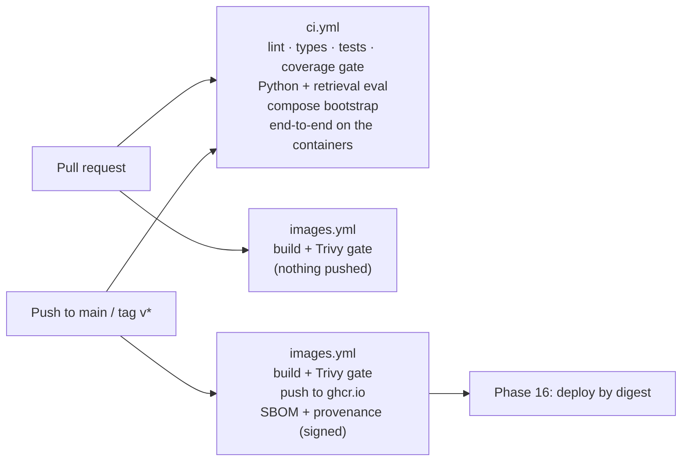

# CI/CD

Two workflows. `ci.yml` decides whether a change is correct; `images.yml` turns `main` into
signed, scanned container images. Deployment (Phase 16) pulls those images by digest.



## `ci.yml` (every pull request and every push to main)

| Job                                            | Checks                                                                                                 |
| ---------------------------------------------- | ------------------------------------------------------------------------------------------------------ |
| TypeScript (lint, typecheck, test, build)      | Prettier, ESLint, `tsc`, unit/HTTP/integration tests with the coverage gate (Testcontainers), builds   |
| Python (ruff, mypy, pytest, retrieval eval)    | The AI service against real pgvector, including the hit-rate@5 ≥ 0.8 gate                              |
| Docker Compose (bootstrap, migrate, seed)      | A clean `docker compose up`, migrations, no schema drift, seed idempotency, the AI role's restrictions |
| End-to-end on the containers (Playwright, axe) | Builds the images, starts the stack, seeds it, runs every journey through Nginx                        |

## `images.yml` (pull requests, main, and `v*` tags)

One matrix job per image: `forge-api` (also runs the worker), `forge-migrate`, `forge-web` and
`forge-ai-service`.

1. **Build** into the runner's image store, with the GitHub Actions layer cache (one scope per
   image).
2. **Scan** the built image with Trivy: a full table of fixable High and Critical findings goes
   into the job summary, and a second run fails the job on the blocking severities.
3. On `main` and tags only: **push** to `ghcr.io/vishalreddy9514/forge-<image>` (the same inputs,
   so every layer comes from the cache and what is pushed is what was scanned), with an SBOM and
   a `mode=max` provenance attestation from BuildKit, then a **signed build-provenance
   attestation** (`actions/attest-build-provenance`, keyless through GitHub's OIDC identity and
   Sigstore) pushed next to the image. The digest is printed in the job summary.

Tags: `sha-<full commit>` (immutable, what deployments use), `main`, and `X.Y.Z` / `X.Y` for
release tags.

Verify an image before running it:

```sh
gh attestation verify oci://ghcr.io/vishalreddy9514/forge-api:sha-<commit> \
  --owner vishalreddy9514
```

### Vulnerability policy

Trivy reports vulnerabilities that have a fix available (`--ignore-unfixed`); one without a fix
is not actionable by an upgrade and would only train people to ignore the gate.

| Image              | Fails the build on    | Result on 2026-10-02              |
| ------------------ | --------------------- | --------------------------------- |
| `forge-api`        | Critical, High        | 0                                 |
| `forge-web`        | Critical, High        | 0                                 |
| `forge-ai-service` | Critical, High        | 0                                 |
| `forge-migrate`    | Critical (High shown) | 2 High (`mysql2`, `deepmerge-ts`) |

Getting there (Phase 15):

- The first scan found 12 fixable Highs in `forge-api` and 10 in `forge-web`, almost all inside
  the base image's bundled `npm` (`pacote`, `sigstore`, `brace-expansion`, `picomatch`,
  `ip-address`). The runtime images never run npm, corepack or yarn, so they are now deleted in
  the runtime stage.
- `mysql2` and `deepmerge-ts` arrived in `forge-api` with Prisma's CLI (an auto-installed peer of
  `@prisma/client` that nothing imports at run time) and are pruned with the rest of it.
- `forge-migrate` had a Critical in `tar` and seven pnpm advisories, all from the package
  manager's download cache inherited from the build stage. Migrate is now its own stage with the
  installed workspace only (1.94 → 1.22 GB), and the repository moved to pnpm 10.34.6.
- What remains in `forge-migrate` are two Highs in dependencies the Prisma CLI pins exactly
  (`mysql2` 3.15.3, `deepmerge-ts` 7.1.5). Overriding them would run Prisma on versions it was
  not tested with; the image is a one-shot job with no listener that only applies the
  repository's own migrations, so they are reported, not blocking, until Prisma updates them.

## Supply chain

- **Pinned actions.** Every `uses:` names a full commit SHA, with the release tag as a comment.
  A tag that is moved or compromised upstream cannot change what runs here.
- **Dependabot** (`.github/dependabot.yml`) updates npm (grouped), the AI service's uv lockfile,
  the GitHub Actions pins, the compose images and the Dockerfile base images, weekly.
- **Least privilege.** Workflows default to `contents: read`; only the image job asks for
  `packages: write`, `id-token: write` and `attestations: write`, and only uses them on `main`
  and tags. Nothing needs a long-lived secret: GHCR takes the job's `GITHUB_TOKEN`, and the AWS
  deployment (Phase 16) will use OIDC.
