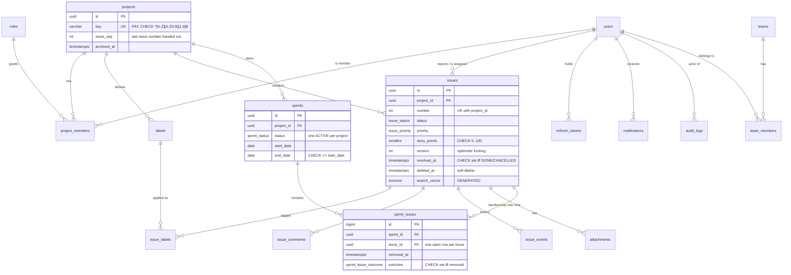
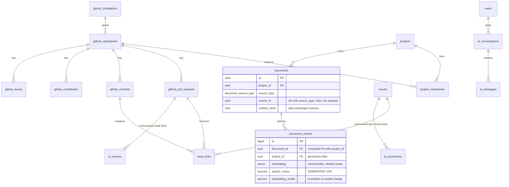

# Database design

> **Phase 3 deliverable.** Source of truth: [`apps/api/prisma/schema.prisma`](../apps/api/prisma/schema.prisma)
> and [`apps/api/prisma/migrations/`](../apps/api/prisma/migrations). This document explains
> _why_ the schema looks the way it does. Every rule described here is covered by an integration
> test in [`apps/api/test/integration/`](../apps/api/test/integration) that runs against a real
> PostgreSQL 16 + pgvector.

## Overview

PostgreSQL 16 with three extensions: `citext` (case-insensitive emails and names), `pg_trgm`
(fuzzy title matching) and `vector` (pgvector 0.8, embeddings for RAG). There are 34 tables in seven
areas:

| Area              | Tables                                                                                                                                                                               |
| ----------------- | ------------------------------------------------------------------------------------------------------------------------------------------------------------------------------------ |
| Identity & access | `users`, `roles`, `refresh_tokens`, `password_reset_tokens`, `teams`, `team_members`                                                                                                 |
| Projects          | `projects`, `project_members`, `labels`                                                                                                                                              |
| Issues            | `issues`, `issue_labels`, `issue_comments`, `issue_events`, `attachments`, `issue_links`                                                                                             |
| Sprints           | `sprints`, `sprint_issues`                                                                                                                                                           |
| Platform          | `notifications`, `audit_logs`, `outbox_events`                                                                                                                                       |
| GitHub            | `github_installations`, `github_repositories`, `project_repositories`, `github_pull_requests`, `github_commits`, `github_contributors`, `github_issues`, `github_webhook_deliveries` |
| RAG & AI          | `documents`, `document_chunks`, `ai_conversations`, `ai_messages`, `ai_jobs`, `ai_summaries`, `ai_reviews`, `ai_usage`                                                               |

## Entity relationships

### Core domain



### GitHub and RAG



## Key decisions

### Identifiers

- **UUIDv7 for entities the API exposes** (users, projects, issues, …). Unlike sequential IDs they
  don't reveal volumes or invite ID guessing. Unlike random UUIDv4 they are time-ordered, so new
  rows land at the end of the B-tree instead of splitting pages at random. Prisma generates them
  (`@default(uuid(7))`), so no database function is needed on PostgreSQL 16.
- **`bigint` identity for high-volume internal rows** (`issue_events`, `sprint_issues`,
  `document_chunks`, `audit_logs`, `outbox_events`, `ai_usage`). They are never exposed, and at
  8 bytes versus 16 they keep large indexes smaller.
- **Human-facing issue keys** (`PAY-123`) are `projects.key` + `issues.number`, with
  `UNIQUE (project_id, number)`.

### Gap-free issue numbers under concurrency

`projects.issue_seq` holds the last number used. The allocator runs
`UPDATE projects SET issue_seq = issue_seq + 1 … RETURNING issue_seq` **inside the transaction
that inserts the issue**:

- The row lock serialises concurrent creates in the same project. They queue instead of reading
  the same value, so there are no duplicates.
- A rolled-back create rolls back the increment, so there are no gaps.
- Creates in different projects lock different rows and never contend.

A Postgres `SEQUENCE` per project was rejected: sequences are non-transactional, so every failed
create would burn a number, and they would need DDL per project. Tested with 25 concurrent
creates (`issues.int-spec.ts`).

### Integrity in the database, not only in code

The API validates everything as well; the database is the last line of defence against a bug, a
script or a manual hotfix.

| Rule                                                                                  | Mechanism                                                                                                               |
| ------------------------------------------------------------------------------------- | ----------------------------------------------------------------------------------------------------------------------- |
| At most one ACTIVE sprint per project, even under two concurrent "start sprint" calls | Partial unique index `ON sprints (project_id) WHERE status = 'ACTIVE'`                                                  |
| An issue is in at most one sprint at a time, but keeps its sprint history             | Partial unique index `ON sprint_issues (issue_id) WHERE removed_at IS NULL`                                             |
| A label on an issue must belong to the issue's project                                | Composite FKs `(issue_id, project_id) → issues (id, project_id)` and `(label_id, project_id) → labels (id, project_id)` |
| An issue can only join a sprint of its own project                                    | The same composite-FK pattern on `sprint_issues`                                                                        |
| A chunk's `project_id` equals its document's                                          | Composite FK `(document_id, project_id) → documents (id, project_id)`                                                   |
| `resolved_at` is set exactly when status is DONE/CANCELLED                            | `CHECK ((status IN ('DONE','CANCELLED')) = (resolved_at IS NOT NULL))`                                                  |
| Sprint timestamps agree with its status                                               | `CHECK` enumerating the valid PLANNED/ACTIVE/COMPLETED combinations                                                     |
| An outcome is recorded exactly when an issue leaves a sprint                          | `CHECK ((removed_at IS NULL) = (outcome IS NULL))`                                                                      |
| An issue link points at exactly one PR or commit, matching its type                   | `CHECK` on `link_type` and the two nullable FKs                                                                         |
| Formats: project key, label colour, token hashes, git SHAs                            | `CHECK` with regular expressions                                                                                        |
| Attachment size limit (10 MiB)                                                        | `CHECK (size_bytes BETWEEN 1 AND 10485760)`                                                                             |

The composite-FK pattern costs one extra `project_id` column on the join tables, plus a
`UNIQUE (id, project_id)` on the parent (a tiny index). It makes cross-project data leaks
impossible to create by accident: an IDOR bug in a future endpoint cannot tag an issue with
another project's label.

### History, soft delete and deletion policy

- **`issue_events`** records every field change (who, when, field, old value, new value as JSON).
  It drives the issue timeline and is the **only input for burndown**: remaining points on any
  day are reconstructed from status and story-point changes, so there is no nightly snapshot job
  that can miss a day.
- **Issues are soft-deleted** (`deleted_at`) so history, PR links and audit references survive
  and a PM can restore. The list and board indexes are partial (`WHERE deleted_at IS NULL`), so
  deleted rows cost nothing on the hot path.
- **Users are never hard-deleted.** They are deactivated (`is_active`), and personal data can be
  anonymised in place for erasure requests. Foreign keys from authored content (issues,
  comments, audit logs) are therefore `RESTRICT`: deleting a user with history fails loudly
  instead of cascading away evidence.
- **Deleting a project** (admin only) cascades to everything the project owns.

### Append-only audit log

`audit_logs` has `BEFORE UPDATE OR DELETE` and `BEFORE TRUNCATE` triggers that raise
`insufficient_privilege`, so not even the application's own database user can rewrite history.
Changing that requires a migration, which is reviewed and itself recorded in git.

### Least-privilege AI role (ADR-0004)

The migration creates a `NOLOGIN` role, `forge_ai`, with `SELECT/INSERT/UPDATE/DELETE` on
`documents` and `document_chunks`, and `INSERT` only on `ai_usage`. The AI service logs in as a
member of that role (`forge_ai_service`, created by the compose init script locally and by
Terraform in AWS; no password is ever in a migration). Tests confirm it cannot read `users`,
`refresh_tokens`, `issues`, `project_members` or `audit_logs`.

### Search

| Need                                     | Implementation                                                                                                                                               |
| ---------------------------------------- | ------------------------------------------------------------------------------------------------------------------------------------------------------------ |
| Keyword search over issues (FR-11.1)     | `issues.search_vector`: a `GENERATED ALWAYS … STORED` tsvector (title weighted A, description B), GIN index. Postgres maintains it, so it can never be stale |
| Fuzzy / partial title match ("reconcil") | `pg_trgm` GIN index on `issues.title`                                                                                                                        |
| Keyword half of hybrid RAG retrieval     | `document_chunks.search_vector` (heading path A, content B), GIN index                                                                                       |
| Semantic half                            | `document_chunks.embedding vector(1536)`, **HNSW** index with `vector_cosine_ops`                                                                            |

**HNSW over IVFFlat.** IVFFlat needs a training step on representative data and loses recall as
data drifts. HNSW can be built on an empty table and stays accurate as rows arrive, at the cost
of slower index builds and more memory, which is irrelevant at this scale.

**Filtered vector search.** Retrieval always filters by `project_id = ANY(:allowed)`. pgvector
0.8's iterative index scans (`SET hnsw.iterative_scan = relaxed_order`) keep returning results
when the filter discards many neighbours. The query and its tuning belong to Phase 10.

### Indexes

Every index corresponds to a known query. The ones worth calling out:

| Index                                                                    | Serves                                                                              |
| ------------------------------------------------------------------------ | ----------------------------------------------------------------------------------- |
| `project_members (user_id)`                                              | "Which projects can this user access?", on the hot path of every authorised request |
| `issues (project_id, status) WHERE deleted_at IS NULL`                   | Board columns, status filters, dashboard counts                                     |
| `issues (project_id, updated_at DESC, id DESC) WHERE deleted_at IS NULL` | Default issue list order, with `id` as the cursor-pagination tie-breaker            |
| `issues (assignee_id, status)`                                           | "My issues", developer workload                                                     |
| `issue_events (issue_id, created_at)`                                    | Timeline, burndown                                                                  |
| `notifications (user_id) WHERE read_at IS NULL`                          | Unread badge (tiny, because most notifications are read)                            |
| `outbox_events (id) WHERE published_at IS NULL`                          | Outbox relay: `… ORDER BY id FOR UPDATE SKIP LOCKED`                                |
| `github_pull_requests (repository_id, state, opened_at DESC)`            | PR activity views                                                                   |
| `ai_usage (created_at DESC)`, `(user_id, created_at DESC)`               | AI usage dashboard, per-user daily budget                                           |

### Concurrency patterns the schema supports

| Pattern                                                               | Where                                                                                                                                                        |
| --------------------------------------------------------------------- | ------------------------------------------------------------------------------------------------------------------------------------------------------------ |
| Row lock via `UPDATE … RETURNING`                                     | Issue number allocation                                                                                                                                      |
| Optimistic locking (`version` column, `WHERE id = ? AND version = ?`) | Issue updates, so concurrent edits return `409` instead of silently overwriting (FR-4.8)                                                                     |
| `FOR UPDATE SKIP LOCKED`                                              | Outbox relay: several workers claim disjoint batches without blocking (tested)                                                                               |
| Unique constraints as idempotency keys                                | `documents (source_type, source_id)`, `ai_reviews (pull_request_id, head_sha)`, `ai_summaries (issue_id, thread_hash)`, `github_pull_requests (github_id)`   |
| Last-write-wins by source timestamp                                   | `github_pull_requests` and `github_issues.github_updated_at`: writes apply only if newer, so out-of-order deliveries are safe (tested, and mutation-checked) |
| Delivery ID as primary key                                            | `github_webhook_deliveries.id` is GitHub's `X-GitHub-Delivery`: a redelivered webhook inserts nothing (`ON CONFLICT DO NOTHING`) and queues nothing new      |

## Working with the schema

```bash
pnpm --filter @forge/api db:migrate      # create + apply a migration after editing schema.prisma
pnpm --filter @forge/api db:deploy       # apply pending migrations (what CI/deploys run)
pnpm --filter @forge/api db:seed         # demo data (skipped if the database already has data)
pnpm --filter @forge/api db:reset        # drop, re-migrate, re-seed (local only)
pnpm --filter @forge/api db:studio       # browse data in Prisma Studio
pnpm --filter @forge/api test:integration  # schema tests against a throwaway Postgres
```

**Changing the schema.** Edit `schema.prisma` and run `db:migrate`. If the change needs something
Prisma cannot express (a CHECK, a partial index, a trigger), use
`prisma migrate dev --create-only`, add the SQL to the generated file, then apply it. Features
declared in `schema.prisma` as `Unsupported` or `dbgenerated`, such as the generated tsvector
columns and the vector/GIN indexes, are mirrored there so that `prisma migrate diff` reports **no
drift**. That is checked in CI and in `migrations.int-spec.ts`.

**Seed data.** Six users (password `forge-demo-password` locally, or `SEED_USER_PASSWORD`), two
projects (`PAY`, `AUTH`), three PAY sprints (completed, active, planned, including a carried-over
issue) and 17 realistic issues with comments and status history. It runs in a single transaction,
so a failure leaves the database empty rather than half-seeded, and it refuses to run with
`NODE_ENV=production`.
