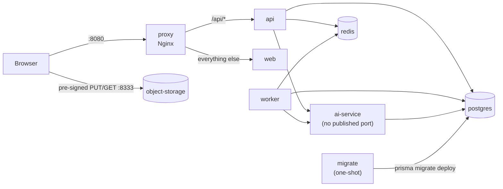

# Running Forge in containers

The `app` profile of `docker-compose.yml` runs the whole product from its production images,
wired the way it runs in AWS: one origin behind a reverse proxy, the AI service unreachable from
outside, and migrations applied by a one-shot job before anything starts.

```sh
cp .env.example .env    # once (optional: the stack works without it)
pnpm stack:up           # builds the images, migrates, starts everything, waits until healthy
pnpm stack:seed         # optional demo data (the same seed as `pnpm db:seed`)
open http://localhost:8080
pnpm stack:down
```

`pnpm stack:up` first creates `infrastructure/docker/.stack.env` (git-ignored) with an ES256 key
pair for access tokens and the AI service token, because the API refuses to start in production
without real keys. Nothing secret is baked into an image.

## What runs



| Service      | Image                         | Size (2026-10-02) | Runs as         | Health                           |
| ------------ | ----------------------------- | ----------------- | --------------- | -------------------------------- |
| `proxy`      | `nginx:1.29-alpine`           | 94 MB             | `nginx` (101)   | `/api/v1/health/live` through it |
| `web`        | `apps/web/Dockerfile`         | 388 MB            | `node` (1000)   | `GET /login`                     |
| `api`        | `apps/api/Dockerfile` runtime | 661 MB            | `node` (1000)   | `/api/v1/health/live`            |
| `worker`     | the same image as `api`       | (shared)          | `node` (1000)   | process (no HTTP port)           |
| `ai-service` | `apps/ai-service/Dockerfile`  | 311 MB            | `forge` (10001) | `/health/live`                   |
| `migrate`    | `apps/api/Dockerfile` migrate | 1.9 GB            | `node` (1000)   | exits 0 when done                |

## Design notes

- **One image for the API and the worker.** They are the same NestJS code base with two entry
  points (`dist/main.js`, `dist/worker.js`), so they always deploy the same commit. In AWS they
  become two ECS services from one ECR image.
- **Migrations are a job, not a startup step.** `migrate` runs `prisma migrate deploy` and exits;
  `api`, `worker` and `ai-service` wait for it to complete successfully. Two API replicas never
  race to migrate, and the runtime image carries no migration tooling. The migrate image is the
  build stage (it has the Prisma CLI and `tsx` for the seed), which is why it is large; it never
  serves traffic.
- **Small runtime images.** The web image is Next.js's standalone output (only the files its
  server traces). The API image is `pnpm deploy --prod`, minus Prisma's CLI tooling that arrives
  as auto-installed peers of `@prisma/client` and that nothing imports at run time (913 → 661 MB;
  the full end-to-end suite passes on the trimmed image). The AI image is a `uv sync --no-dev`
  virtual environment on `python:3.12-slim`.
- **Nginx is the single origin** (`infrastructure/docker/nginx/nginx.conf`), as the ALB is in AWS:
  the refresh cookie stays `SameSite=Strict` and no CORS is needed. `/api/*` has response
  buffering off so AI drafts and chat stream as Server-Sent Events, and Nginx's request ID is
  passed on as `X-Request-Id`, which the API logs and returns. The API trusts one proxy hop
  (`TRUST_PROXY_HOPS=1`), so rate limits and audit rows see the browser's address.
- **The AI service has no published port.** Only `api` and `worker` reach it, on the compose
  network, with the shared service token (architecture §3).
- **Attachments bypass the proxy.** Browsers upload and download with pre-signed URLs, so the
  API signs them for `S3_PUBLIC_ENDPOINT` (`http://localhost:8333`) while it talks to
  `object-storage:8333` itself.
- **Builds behind a TLS-intercepting proxy.** Each network step accepts an optional `build_ca`
  build secret (`BUILD_CA_CERT=/path/to/ca.pem pnpm stack:up`). Without it nothing changes.

## Verified

CI (`End-to-end on the containers`) builds the three images, starts this stack, seeds it inside
the migrate image, and runs every Playwright journey through Nginx on port 8080: sign-in, issues
and the board, sprints, notifications and roles, AI drafts and the cited assistant, attachments
to and from object storage, and the axe accessibility checks. It runs the images with
`STACK_NODE_ENV=test` and `STACK_RATE_LIMITS_ENABLED=false`, the one difference from production
(see [testing](testing.md)).

Found while containerising: SeaweedFS's defaults preallocated 1 GB per volume file and created
seven at once for a new bucket, so the first upload took about 7 GB of disk in local
development. The compose command now uses 64 MB volumes without preallocation.
