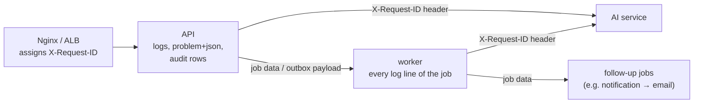

# Observability

How to tell what Forge is doing, and what is wrong with it, without reading code
([architecture §11](architecture.md#11-observability), NFR-8). Four signals, one ID:

| Signal  | Where it comes from                                                         | Where to look (local)               | Where to look (AWS)                   |
| ------- | --------------------------------------------------------------------------- | ----------------------------------- | ------------------------------------- |
| Logs    | JSON lines: pino (API, worker), structlog (AI service), Nginx access log    | `docker compose logs <service>`     | CloudWatch Logs, `/forge-<env>/<svc>` |
| Metrics | Prometheus endpoints on port 9464 in every service                          | Grafana `:3001`, Prometheus `:9090` | CloudWatch dashboard and alarms       |
| Errors  | Sentry, when `SENTRY_DSN` is set; scrubbed of credentials and personal data | Sentry                              | Sentry (`error_reporting = true`)     |
| Health  | `/health/live` and `/health/ready` on the API and the AI service            | `docker compose ps`                 | ALB target health                     |

```sh
pnpm stack:up
docker compose --profile app --profile observability up -d   # adds Prometheus and Grafana
open http://localhost:3001     # Forge service overview (anonymous, read-only)
open http://localhost:9090/alerts
```


## One request ID, end to end

Every log line and every error report carries the ID of the request that caused it, across
process boundaries:



- **HTTP.** The first middleware (`observability/http-metrics.ts`) reuses a safe upstream
  `X-Request-ID` (≤ 128 characters of `[A-Za-z0-9._-]`; anything else is replaced, so the ID can
  never inject into logs) or mints one, echoes it on the response, and runs the rest of the
  request inside an `AsyncLocalStorage` context.
- **Queues.** Producers wrap job data with `traced()`; domain events written to the outbox carry
  it in their payload. `@Instrumented` runs each job attempt under that ID; scheduled jobs get
  `<queue>-<job id>`.
- **Logs.** A pino `mixin` adds `requestId` to every line written in that context, including
  code that never sees the HTTP request.
- **AI service.** The API's client sends the header; the AI service binds it to structlog.

Checked on the running stack: Nginx's ID for a `PATCH /issues/:id` appeared in the Nginx access
log, the API's request log and the AI service's `/v1/index` log (via the outbox and the
indexing job), and another request's ID appeared in the notification fan-out and the email job
it enqueued. `test/integration/ai.int-spec.ts` asserts the request → job → AI service path.

## Metrics

Each process serves `GET /metrics` on **port 9464**, a port of its own: Nginx and the ALB route
only the application ports, and in AWS no security group admits 9464, so metrics are readable
from inside the network only. `METRICS_PORT=0` turns the endpoint off (tests).

Labels are bounded by construction: routes are templates (`/api/v1/issues/:issueId`); requests
no controller handles share `route="unmatched"` (so a scanner cannot create series); nothing is
labelled by user, project or issue.

| Metric                                   | Type      | Labels                                           | From        |
| ---------------------------------------- | --------- | ------------------------------------------------ | ----------- |
| `forge_http_request_duration_seconds`    | histogram | method, route, status                            | API         |
| `forge_job_duration_seconds`             | histogram | queue, job, outcome (completed, failed, delayed) | worker      |
| `forge_jobs_dead_lettered_total`         | counter   | queue, job                                       | worker      |
| `forge_queue_jobs`                       | gauge     | queue, state (waiting, active, delayed, failed)  | worker      |
| `forge_db_pool_connections`              | gauge     | state (total, idle, waiting)                     | API, worker |
| `forge_github_rate_limit_remaining`      | gauge     | installation                                     | API, worker |
| `forge_ai_unavailable_total`             | counter   |                                                  | API, worker |
| `forge_ai_http_request_duration_seconds` | histogram | method, route, status                            | AI service  |
| `forge_llm_request_duration_seconds`     | histogram | feature, operation, model, outcome               | AI service  |
| `forge_llm_tokens_total`                 | counter   | feature, model, direction                        | AI service  |
| `forge_llm_cost_usd_total`               | counter   | feature, model                                   | AI service  |

Plus the client libraries' runtime metrics (`process_*`, `nodejs_*`, `python_*`).

Design notes:

- **Every model call is metered at the provider.** `MeteredChatProvider` and `MeteredEmbedder`
  wrap whatever provider is configured, so drafts, summaries, reviews, chat and retrieval are
  measured the same way. The cost is the same estimate recorded in `ai_usage` (NFR-12). A stream
  the client abandons counts as `cancelled`, not as an error.
- **A postponed job is not a failed one.** A GitHub rate limit throws BullMQ's `DelayedError`;
  it is recorded as `delayed`. A job is dead-lettered when its last attempt fails, or at once
  on an `UnrecoverableError`.
- **Queue depth comes from the worker only**, so a sum over the fleet does not double it.
- **AI service HTTP timing runs to the last byte.** It is a pure ASGI middleware, so a streamed
  answer is measured until it ends, not until its headers are sent.

## Dashboard

`observability/grafana/dashboards/forge-overview.json`, provisioned into Grafana:

- **Headline:** request rate, 5xx ratio, p95 latency (NFR-1's 250 ms target), jobs waiting.
- **API:** requests and p95 latency by route, responses by status class, latency percentiles.
- **Background jobs:** waiting jobs by queue, attempts by outcome, p95 duration, dead letters.
- **AI:** model calls and p95 latency by feature, tokens per minute, estimated spend per hour,
  failed calls and degraded mode.
- **Dependencies and runtime:** database pool, GitHub requests left, event-loop lag, memory, CPU.

CI checks that every metric the dashboard queries is one a service exports
(`observability/check_dashboard.py`), so renaming a metric fails the build instead of quietly
emptying a panel.

## Alerts

`observability/prometheus/alerts.yml`; each has a `for` so a blip does not page anyone.

| Alert                     | Fires when                                                    | Severity |
| ------------------------- | ------------------------------------------------------------- | -------- |
| `ForgeTargetDown`         | a service misses scrapes for 2 minutes                        | critical |
| `ForgeApiHighErrorRate`   | more than 5% of API requests are 5xx for 5 minutes            | critical |
| `ForgeApiSlow`            | API p95 above 1 s for 10 minutes                              | warning  |
| `ForgeQueueBacklog`       | a queue has more than 100 waiting jobs for 10 minutes         | warning  |
| `ForgeJobsDeadLettered`   | any job failed every attempt in the last 15 minutes           | warning  |
| `ForgeLlmErrorRate`       | more than 20% of a feature's model calls fail for 10 minutes  | warning  |
| `ForgeAiUnavailable`      | the API could not reach the AI service (degraded mode, NFR-4) | warning  |
| `ForgeLlmSpendHigh`       | more than $1 of model spend in an hour                        | warning  |
| `ForgeGithubRateLimitLow` | an installation has fewer than 500 GitHub requests left       | warning  |
| `ForgeDbPoolSaturated`    | requests have waited for a database connection for 5 minutes  | warning  |

`alerts.test.yml` is a `promtool test rules` suite: a silent target pages after two minutes and
not before, 10% errors fire and 1% do not, a backlog alerts only when it lasts, a dead letter
alerts at once, failing model calls alert per feature. CI runs it with `promtool check config`.

In AWS the paging alarms are CloudWatch alarms on the load balancer, RDS and ElastiCache
([deployment](deployment.md#operating)), with a CloudWatch dashboard of the same headline
signals. Prometheus is not deployed there: a scraper (Amazon Managed Service for Prometheus, or
a self-run instance) would need its own ingress rule for port 9464.

## Errors

Sentry, off unless `SENTRY_DSN` is set (in AWS, `error_reporting = true` and the operator-set
parameter `/forge-<env>/sentry-dsn`). What is reported:

- **API:** unexpected exceptions only (`ProblemDetailsFilter`): not validation errors, 404s, or
  the 503 of degraded AI mode, which the API returns on purpose.
- **Worker:** a job's final failure (dead letter), not attempts that a retry later fixes.
- **AI service:** unhandled exceptions (Sentry's FastAPI integration).

Every report carries the request ID, the service and the route or queue, and never:
authenticating headers, cookies, request bodies (issue text, comments, prompts), query strings,
the user, or local variables (the AI service's would hold prompts and answers). Collection is
switched off at the source (`dataCollection`, `send_default_pii=False`,
`include_local_variables=False`), and a `beforeSend` scrubber removes anything left. Both are
tested by sending a real error to a fake Sentry endpoint and inspecting what arrived.

## Not done here

- **Tracing** (OpenTelemetry → Jaeger, or X-Ray in AWS) is a "Could" in the architecture. The
  request ID gives log correlation; spans would add per-hop timing.
- **The web app** reports no metrics or errors of its own; its server is a thin layer over the
  API, whose metrics cover the requests it proxies.
